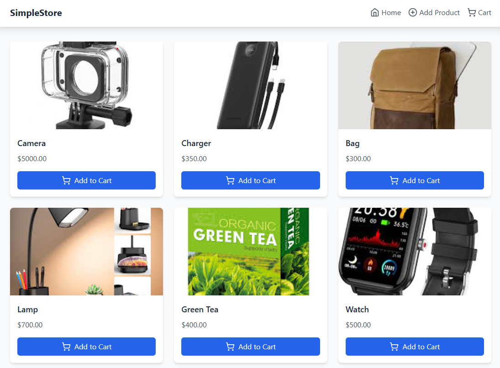
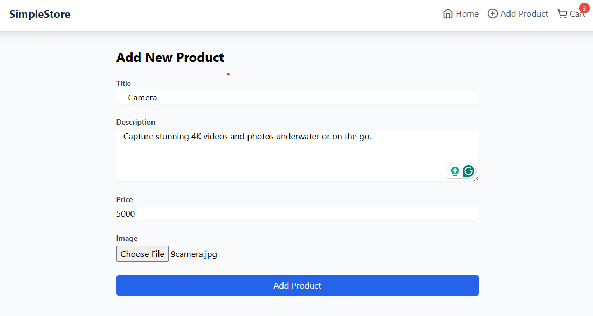
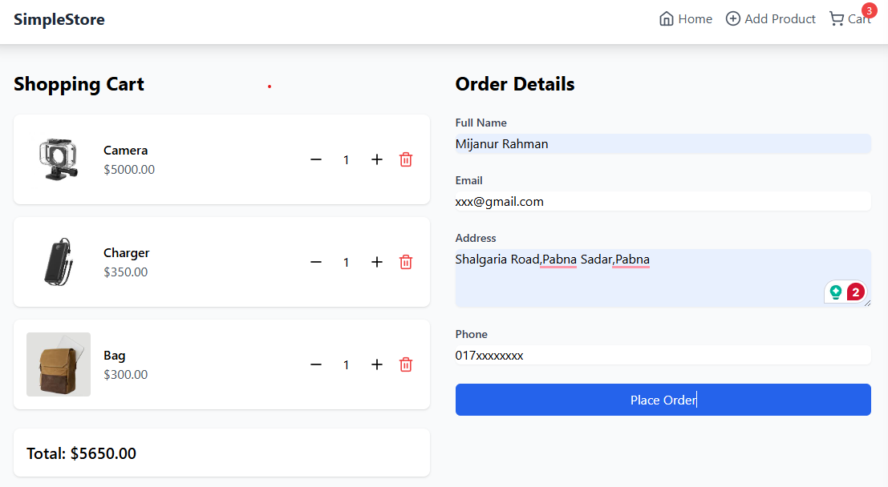

# 🛒 Simple E-Commerce Store

A complete, modern, and responsive e-commerce web application built with the **MERN stack** (MongoDB, Express, React, Node.js). This project includes full shopping functionality, product management, cart handling, image uploads, and a smooth UI experience.

---

## 📸 Project Screenshots

### 🏠 Home Page

### ➕ Add Product Page

### 🛒 Cart Page

## 🚀 Features

### Frontend (React)

-   Responsive UI built with **Tailwind CSS**
-   Cart management using **Context API**
-   Form handling with **React Hook Form** + **Zod** for validation
-   **Toast notifications** for real-time feedback
-   Complete **React Router** based routing

### Backend (Node.js + Express)

-   MongoDB integration with **Mongoose**
-   Image uploads to **Cloudinary**
-   RESTful API endpoints for product, cart, and order management
-   Order processing system
-   File uploads handled with **Multer**

---

Functionalities

-   Home Page – Displays all products

-   Add Product Page – Admin-like interface to upload new products
-   Cart Page – View and manage your selected items

-   Product Details Page – See full information about each product

-   Order System – Processes user checkouts

-   Image Upload – Uploads product images to Cloudinary

-   Data Persistence – MongoDB stores all product and order data

-   Fully Responsive – Looks great on all screen sizes

-   Form Validation – Clean, user-friendly forms with proper error handling
